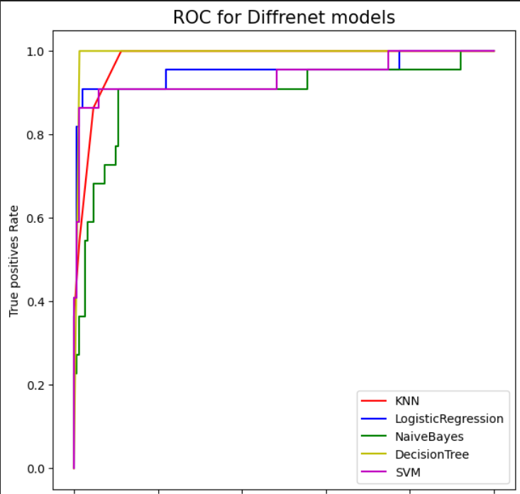

# Covid-19-Fatality
This project was submitted to `CSE375s` - `Machine Learning and Pattern Recognition` Course in `Fall 2021` Semester

Covid Fatality Prediction using Machine Learning: 

This project aims to create a machine learning model that can predict the likelihood of a patient's fatality based on 13 features, including personal data and symptoms. The model uses various algorithms such as **KNN**, **Logistic Regression**, **Naive Bayes**, **Decision Tree**, and **SVM**.

ROC Score of all algorithms:

